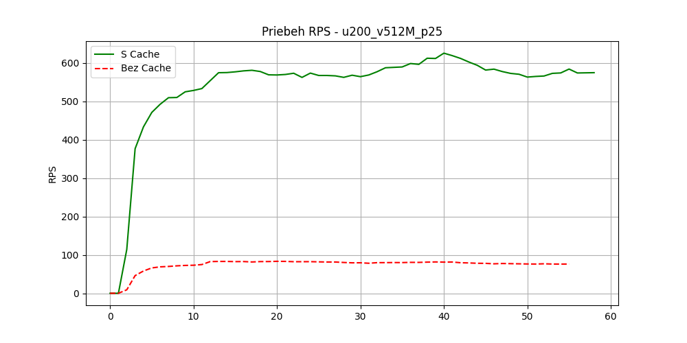
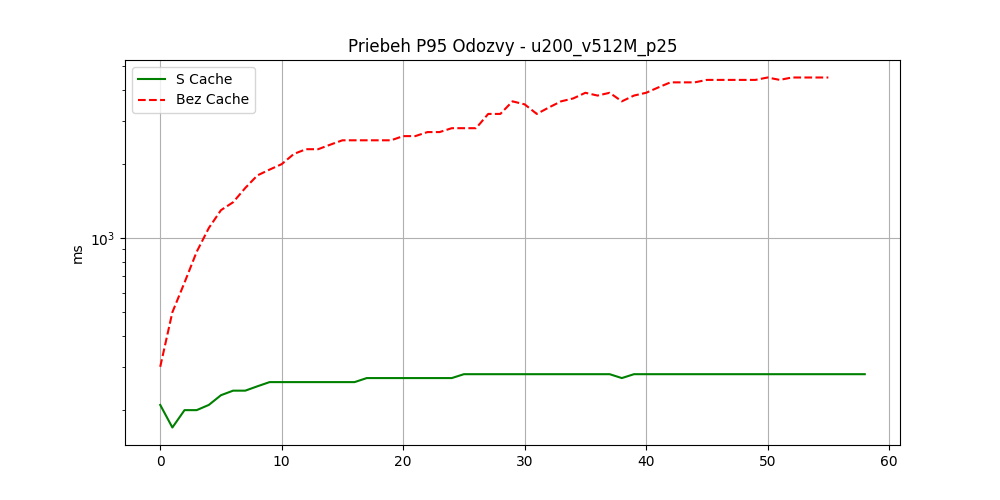

# Report z experimentu: u200_v512M_p25

## 1. Produkčná Konfigurácia (Realistický Tuning)
Tento experiment simuluje stredne veľký e-shop na serveri s cca 4GB RAM:
*   **Varnish Cache Memory:** 512M
*   **PHP-FPM Max Workers:** 25

## 2. Monitoring Infraštruktúry
*   **Varnish Hit Ratio:** 99.99%
*   **Redis Keyspace Hits:** 2335746

## 3. Celkové výsledky
| Metrika | S Cache (Varnish) | Bez Cache (Nginx) |
| :--- | :--- | :--- |
| **Priemerné RPS** | **578.3** | 79.4 |
| **Max P95 Latency** | **280 ms** | 4500 ms |

## 4. Grafy priebehu

